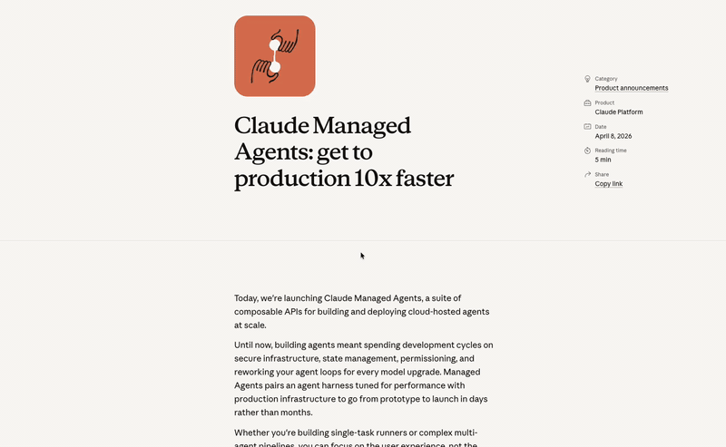

<div align="center">

# ✨ Enja

**Cmd+C 連打の翻訳に加えて、Fn で音声入力、Fn+Space で選択テキストへの音声指示。翻訳・タイプ・Typeless ライクな音声操作を macOS 上で素早く扱える常駐 AI アシスタントです。**

### 翻訳も、音声入力も、音声指示もすぐに

コピーしてから **もう一度 Command+C**（デフォルト **400ms 以内**の連打）で、クリップボードの内容が **Google Gemini API** へ送られ、ストリーミング翻訳が表示されます。さらに **Fn** で現在の入力先へ音声入力、**Fn+Space** で選択テキストに対する音声指示を実行できます。文章作成、書き換え、メモ、チャット返信など、翻訳以外のタスクにも使えます。



[](LICENSE)
[](https://tauri.app/)
[](https://github.com/rayyyy/enja)

</div>

---

**English:** **Enja** is a macOS desktop app (Tauri 2) that started as a two-tap Cmd+C translator and now also provides typing and Typeless-like voice workflows. It can stream translations from Google **Gemini API**, dictate text into the active input target, and apply spoken instructions to selected text. Settings and provider secrets stay on your machine; translation, speech recognition, and final text generation requests are sent to the configured providers.

---

|                                 |                                                                                                                                           |
| ------------------------------- | ----------------------------------------------------------------------------------------------------------------------------------------- |
| **Default translation model**   | `gemini-3.1-flash-lite-preview`（[`src-tauri/src/gemini.rs`](src-tauri/src/gemini.rs) 内の定数。Google の提供状況により変更の可能性あり） |
| **Default voice finalizer**     | `gemini-3.5-flash`（音声認識結果の整形・音声指示の最終出力に使用）                                                                         |
| **Speech recognition options**  | Google Speech-to-Text Chirp 3 / OpenAI gpt-4o transcribe / Gemini 音声入力 / Apple SpeechAnalyzer                                          |
| **License**                     | [MIT](LICENSE)                                                                                                                            |
| **Contributing**                | [CONTRIBUTING.md](CONTRIBUTING.md)                                                                                                        |
| **Security**                    | [SECURITY.md](SECURITY.md) · [Code of Conduct](CODE_OF_CONDUCT.md)                                                                        |

## プライバシーとデータの取り扱い

- **クリップボード / 選択テキスト**: Cmd+C 連打の翻訳ではクリップボードのテキストが、音声指示では選択テキストが **Google Gemini API**（`generativelanguage.googleapis.com`）へ送信されることがあります。Google の利用規約・プライバシーポリシーが適用されます。
- **音声データ / 画面文脈**: 音声入力では録音した音声が、設定した音声認識プロバイダ（Google Speech-to-Text / OpenAI / Gemini）へ送信されます。Apple SpeechAnalyzerを選択した場合、音声認識は対応Mac上のオンデバイス処理です。認識結果は Gemini で自然な文章に整形され、音声指示では選択テキストと指示内容をもとに最終テキストを生成します（整形しない音声モードでは認識結果をそのまま使います）。画面文脈が有効な場合、入力先のアプリ名、ウィンドウ名、カーソル前後、表示テキスト、OCRで抽出した文字が、音声認識と整形のヒントとして利用プロバイダへ送信されることがあります。OCRは推敲だけのフローでは使わず、音声認識または整形に効く経路だけで実行します。設定から画面文脈またはOCRだけをオフにできます。
- **API キー / 認証情報**: アプリの設定で保存した Gemini / OpenAI API キーや Google Service Account は macOS Keychain（実装は [`src-tauri/src/secrets.rs`](src-tauri/src/secrets.rs)）に保存され、`settings.json` にはモデル・ショートカット・プロンプトなどの非秘密情報だけを書き込みます。リポジトリや Issue にキーを載せないでください。
- **常駐と権限**: グローバルなショートカット検出、マイク録音、現在の入力先への貼り付けには macOS の権限が必要です（下記「macOS の権限」）。

## 必要なもの

| もの                                                  | 用途                                               |
| ----------------------------------------------------- | -------------------------------------------------- |
| [mise](https://mise.jdx.dev/)（推奨）                 | Bun / Rust のバージョン管理                        |
| [Gemini API キー](https://aistudio.google.com/apikey) | 翻訳、音声入力結果の整形、音声指示の最終生成       |
| 音声認識プロバイダの認証情報                          | Google Chirp 3 / OpenAI / Gemini 音声入力を使う場合          |
| Apple SpeechAnalyzer対応SDK                           | Apple SpeechAnalyzer helperをビルドする場合（未対応SDKではアプリ本体のみビルド可能） |
| Xcode Command Line Tools（macOS）                     | リンカ・SDK（未導入なら `xcode-select --install`） |

このリポジトリでは **[mise.toml](mise.toml)** で **Bun** と **Rust** のバージョンを固定しています。mise を使わない場合は、同等以上のバージョンを手動で入れてください。

---

## 立ち上げ方（初回）

リポジトリのルートで次を実行します。

```bash
cd /path/to/enja

# 1) mise で Bun / Rust を入れる（PATH が通るシェルで）
mise install

# 2) フロントの依存関係
bun install

# 3) 開発モード（Vite + Tauri ウィンドウ）
bun run tauri dev
```

初回は Rust のコンパイルで時間がかかります。API キー未設定のときはウィンドウが開くので、**設定** から Gemini API キーを保存してください。

### mise のタスクを使う場合

```bash
mise install
mise run dev
```

`dev` は `bun install` から実行するので、2 回目以降もそのまま使えます。

---

## 普段の開発（2 回目以降）

```bash
mise install   # mise.toml を変えたときだけでよい
bun run tauri dev
```

フロントだけ試す場合（ネイティブやホットキーなし）:

```bash
bun run dev
# または
mise run vite-only
```

---

## 本番ビルド

```bash
bun run tauri build
# または
mise run build
```

成果物は `src-tauri/target/release/` 付近に生成されます（Tauri の表示に従ってください。）

### コード署名（任意）

macOS でアプリを `/Applications` に置いて常用する場合、コード署名しておくとアップグレード時にアクセシビリティ・入力監視の再許可が不要になります。

1. [`.env.example`](.env.example) を `.env` にコピーする
2. `security find-identity -v -p codesigning` で自分の証明書を確認する
3. `.env` の `APPLE_SIGNING_IDENTITY` に証明書名を設定する（`mise run build` では `.env` が自動で読み込まれます）

署名には Apple Developer Program の登録が必要です。未登録でもビルド・開発は問題なくできますが、アプリを上書きインストールするたびに macOS の権限設定をやり直す必要がある場合があります。

---

## macOS の権限

- **アクセシビリティ**: グローバルな Cmd+C 検出、音声ショートカット、選択テキストの取得に必要です。
  **システム設定 → プライバシーとセキュリティ → アクセシビリティ** で、開発中は **ターミナル** や **Cursor**、配布版では **Enja** を許可してください。
- **入力監視**: 環境によっては **システム設定 → プライバシーとセキュリティ → 入力監視** にも Enja が表示されることがあります。許可がオフの場合はオンにしてください。
- **マイク**: 音声入力に必要です。初回録音時に許可を求められたら **Enja** を許可してください。
- **画面収録**: 画面OCRを使う場合に必要になることがあります。許可しない場合でも、アクセシビリティで取得できる入力先や表示テキストの文脈は利用されます。
- **オートメーション**: 現在の入力先へ音声入力結果を貼り付けるため、**System Events** の操作許可を求められることがあります。許可しない場合、結果はコピー用オーバーレイに表示されます。
- **アップグレード時（署名なしビルド）**: `/Applications` にアプリを上書きすると、macOS が別アプリとみなし、アクセシビリティや入力監視の許可が無効になることがあります。**プライバシーとセキュリティ** の一覧から **Enja** を削除し、アプリを再度起動して許可し直してください。
- **アップグレード時（署名ありビルド）**: 上記の `.env` で `APPLE_SIGNING_IDENTITY` を設定してビルドした場合、同じ Bundle ID と安定した署名のまま置き換えできるため、通常は権限の再設定は不要です。
- 初回に説明文を出すには **Info.plist の `NSAccessibilityUsageDescription`** が必要な場合があります（配布ビルド時に検討）。

---

## 使い方（アプリ）

1. **設定** で Gemini API キーを保存する。音声入力を使う場合は、利用する音声認識プロバイダの認証情報とマイクも設定する。
2. テキストを選択して **Cmd+C** でコピーし、すぐにもう一度 **Cmd+C** を押すとオーバーレイが開き、翻訳がストリーミング表示される。**これだけで OK — Command+C を 2 回押すだけで、すぐに翻訳が始まります。**
3. **Fn**（既定）で音声入力を開始 / 停止する。録音内容は文字起こし・整形され、現在フォーカス中のテキスト入力欄へ貼り付けられる。入力先が見つからない場合はコピー用オーバーレイに表示される。
4. テキストを選択して **Fn+Space**（既定）を押すと、選択テキストへの音声指示を実行できる。話した指示に従って、文章の書き換え、要約、返信文作成などを行う。
5. **Esc** またはオーバーレイ外クリックで翻訳ウィンドウを閉じる。音声録音中の **Esc** はセッションをキャンセルする（プロセスは常駐し、ウィンドウは `hide` のみ）。

操作のイメージは README 冒頭の GIF をご覧ください。

---

## 構成

- **フロント**: React + TypeScript + Vite + Tailwind CSS v4 + Zustand
- **ネイティブ**: Tauri 2（Rust）。macOS では **CGEventTap** によるパッシブなキー監視（[`src-tauri/src/keyboard.rs`](src-tauri/src/keyboard.rs)）、**arboard** でクリップボード読み取り / 貼り付け、**cpal** でマイク録音。
- **Gemini / 音声**: フロントから `translate` や音声セッションを `invoke` し、Rust の **reqwest** で Gemini の SSE ストリーム、クラウド音声認識プロバイダ、最終整形を処理して UI に渡す。Apple SpeechAnalyzerはSwift helperでオンデバイス認識します（[`src-tauri/src/lib.rs`](src-tauri/src/lib.rs)、[`src-tauri/src/gemini.rs`](src-tauri/src/gemini.rs)、[`src-tauri/src/voice.rs`](src-tauri/src/voice.rs)、[`docs/apple-speechanalyzer.md`](docs/apple-speechanalyzer.md)）

詳細は [docs/architecture.md](docs/architecture.md) を参照してください。

---

## トラブルシューティング

| 症状                                                     | 確認                                                                             |
| -------------------------------------------------------- | -------------------------------------------------------------------------------- |
| `cargo` / `rustc` が見つからない                         | `mise install` 後にシェルを開き直す、`eval "$(mise activate)"` を入れる          |
| `tauri` が見つからない                                   | プロジェクト直下で `bun install`（`@tauri-apps/cli` が devDependency）           |
| Cmd+C 連打で反応しない                                   | アクセシビリティでホストアプリ（ターミナル等）を許可したか                       |
| 音声入力が開始できない / 録音されない                     | マイク権限、入力デバイス、音声認識プロバイダの認証情報を確認                     |
| 音声入力結果が貼り付けられない                            | アクセシビリティ / オートメーション権限、フォーカス中の入力欄を確認。失敗時はコピー用表示を使う |
| アップグレード後に Cmd+C が効かない                      | **アクセシビリティ** と **入力監視** から Enja を削除 → 再起動して再許可。署名ビルドなら再発しにくい |
| ビルドエラー（リンカ）                                   | Xcode CLT のインストール、`rustup target list` で Apple ターゲット               |
| `rustc x.x.x is not supported by the following packages` | [mise.toml](mise.toml) の Rust を上げ、`mise install` をやり直す（シェル再起動） |

バージョンを上げるときは **mise.toml** の `[tools]` を更新してください。
